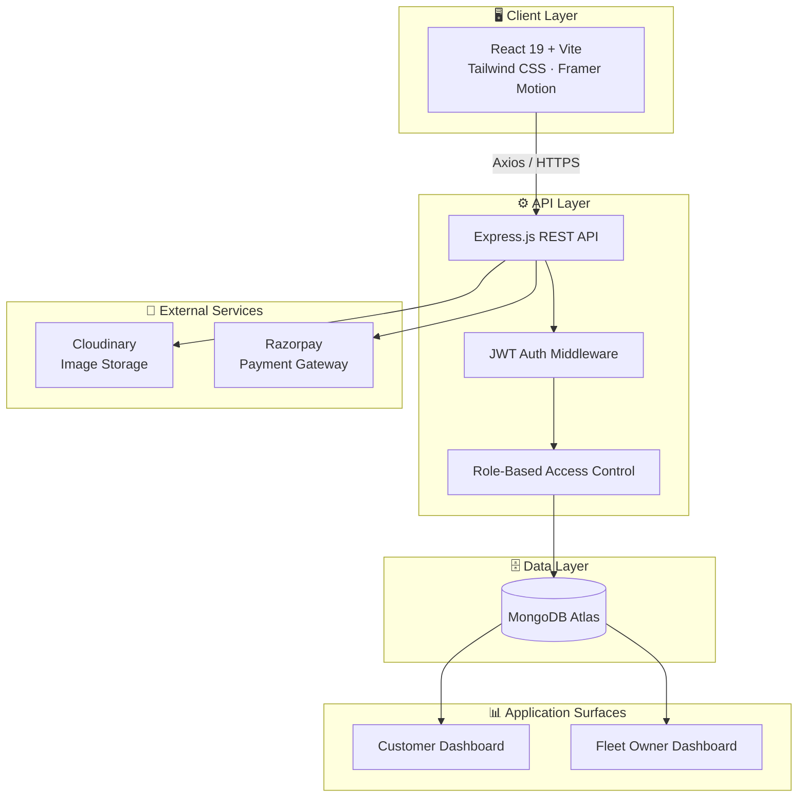
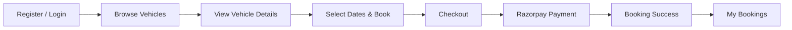
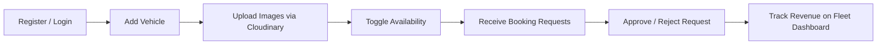
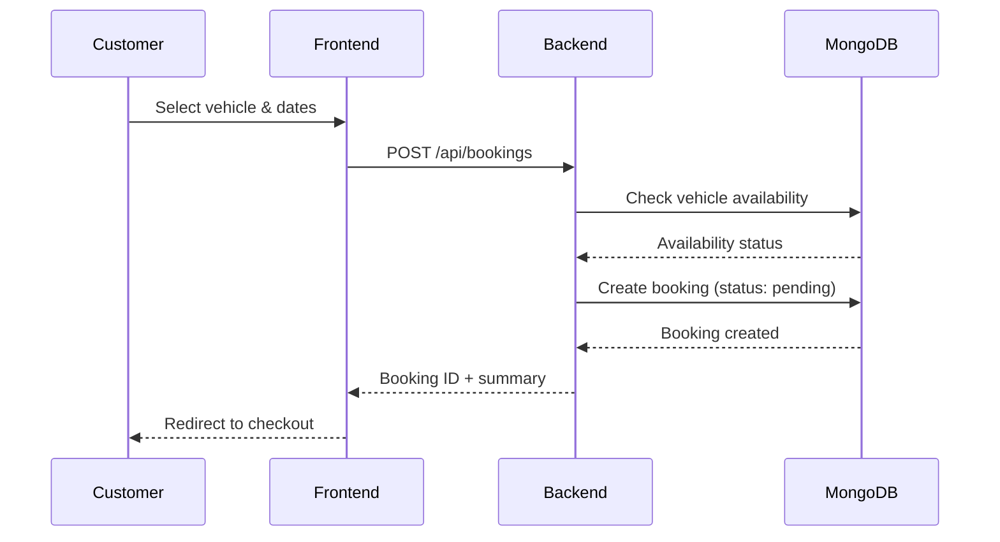
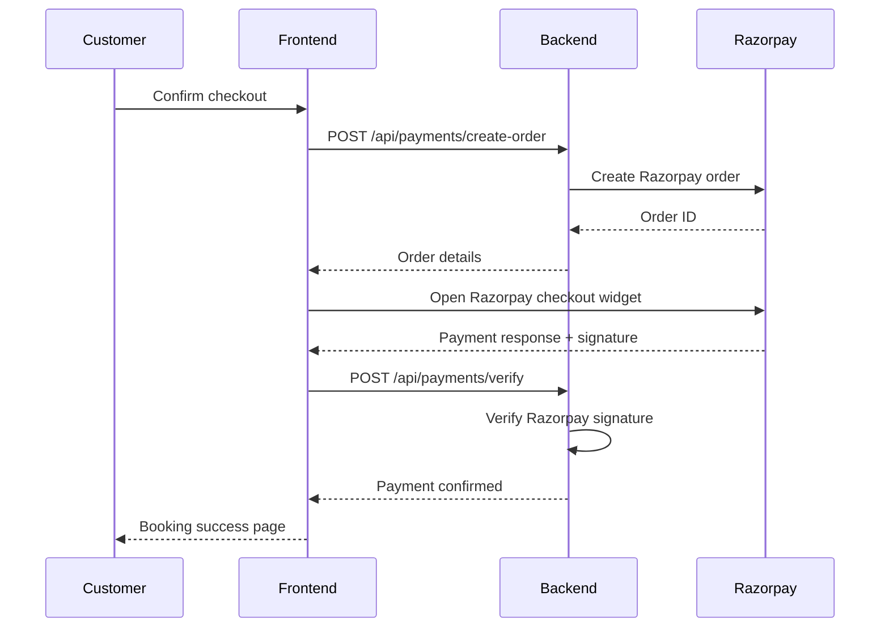

<div align="center">

# 🚗 RentX

### A Production-Grade Vehicle Rental Marketplace

*Connecting fleet owners and customers through a secure, transaction-safe booking and payment platform.*

[](https://your-live-demo-url.vercel.app)
[](https://github.com/your-username/rentx)


</div>

<br>

## 📖 Introduction

RentX is a full-stack vehicle rental platform built on the MERN stack, modeled after real-world marketplaces like Zoomcar and Turo. Rather than a simple listings-and-forms app, RentX is built around the two hardest parts of any rental marketplace: **keeping bookings consistent under concurrent access** and **moving money safely**. The platform supports two distinct roles — customers who browse and book vehicles, and fleet owners who list and manage their inventory — each with a dedicated dashboard and workflow.

<br>

## 📸 Screenshots

<div align="center">

| Home | Vehicle Listing | Vehicle Details |
|:---:|:---:|:---:|
|  |  |  |

| Checkout | Payment | Booking Success |
|:---:|:---:|:---:|
|  |  |  |

| Fleet Dashboard | My Vehicles | Booking Requests |
|:---:|:---:|:---:|
|  |  |  |

| Analytics |
|:---:|
|  |

</div>

> Replace the placeholder links above with real screenshots or GIFs before publishing — recruiters open the images before they open the code.

<br>

## 🏗️ Architecture



<br>

## 🔀 Project Flow

<details>
<summary><strong>Customer Journey</strong></summary>


</details>

<details>
<summary><strong>Fleet Owner Journey</strong></summary>


</details>

<details>
<summary><strong>Booking Flow</strong></summary>


</details>

<details>
<summary><strong>Payment Flow</strong></summary>


</details>

<br>

## 📁 Folder Structure

```
RentX/
├── client/                      # React frontend
│   ├── src/
│   │   ├── components/          # Reusable UI components
│   │   ├── pages/                # Route-level pages
│   │   ├── context/               # Auth / global state
│   │   ├── hooks/                 # Custom React hooks
│   │   ├── utils/                  # Helpers, API client
│   │   ├── assets/
│   │   └── App.jsx
│   ├── public/
│   └── vite.config.js
│
├── server/                      # Express backend
│   ├── controllers/              # Route handlers
│   ├── models/                    # Mongoose schemas
│   ├── routes/                    # API route definitions
│   ├── middleware/               # Auth, RBAC, error handling
│   ├── config/                    # DB, Cloudinary, Razorpay config
│   ├── utils/
│   └── server.js
│
├── .env.example
├── .gitignore
└── README.md
```

<br>

## ✨ Features

| Module | Capabilities |
|---|---|
| **Authentication** | Register, login, JWT-based sessions, protected API routes, role-based access control |
| **Customer** | Browse vehicles, view details, book, checkout, Razorpay payment, booking success page, booking history |
| **Fleet Owner** | Add / edit / delete vehicles, toggle availability, manage listings, view & respond to booking requests |
| **Dashboard** | Revenue summary, total vehicles, pending requests, recent bookings analytics |
| **Booking System** | Availability checks, booking validation, status tracking, booking history |
| **Security** | JWT verification, middleware-protected routes, Razorpay payment signature verification |

<br>

## 🧰 Tech Stack

| Layer | Technologies |
|---|---|
| **Frontend** | React 19, Vite, Tailwind CSS, React Router, Axios, Framer Motion |
| **Backend** | Node.js, Express.js |
| **Database** | MongoDB Atlas, Mongoose |
| **Authentication** | JWT, Protected Routes, Role-Based Access |
| **Payments** | Razorpay, Signature Verification |
| **Storage** | Cloudinary |
| **Deployment** | Vercel (frontend), Render (backend), MongoDB Atlas (database) |

<br>

## 🔌 REST API Reference

| Method | Endpoint | Description | Auth Required |
|---|---|---|---|
| `POST` | `/api/auth/register` | Register a new user | No |
| `POST` | `/api/auth/login` | Log in and receive a JWT | No |
| `GET` | `/api/vehicles` | List all available vehicles | No |
| `GET` | `/api/vehicles/:id` | Get vehicle details | No |
| `POST` | `/api/vehicles` | Add a new vehicle | Yes (Fleet Owner) |
| `PUT` | `/api/vehicles/:id` | Update vehicle details | Yes (Fleet Owner) |
| `DELETE` | `/api/vehicles/:id` | Remove a vehicle | Yes (Fleet Owner) |
| `PATCH` | `/api/vehicles/:id/availability` | Toggle availability | Yes (Fleet Owner) |
| `POST` | `/api/bookings` | Create a booking | Yes (Customer) |
| `GET` | `/api/bookings/me` | Get my bookings | Yes (Customer) |
| `GET` | `/api/bookings/requests` | Get incoming requests | Yes (Fleet Owner) |
| `PATCH` | `/api/bookings/:id/status` | Approve / reject a booking | Yes (Fleet Owner) |
| `POST` | `/api/payments/create-order` | Create a Razorpay order | Yes |
| `POST` | `/api/payments/verify` | Verify payment signature | Yes |
| `GET` | `/api/dashboard/analytics` | Fleet owner analytics | Yes (Fleet Owner) |

<br>

## 🗄️ Database Collections

| Collection | Key Fields |
|---|---|
| **Users** | `name`, `email`, `password (hashed)`, `role`, `createdAt` |
| **Vehicles** | `ownerId`, `title`, `type`, `pricePerDay`, `images[]`, `isAvailable`, `location` |
| **Bookings** | `customerId`, `vehicleId`, `startDate`, `endDate`, `status`, `totalAmount` |
| **Payments** | `bookingId`, `razorpayOrderId`, `razorpayPaymentId`, `signature`, `status`, `amount` |

<br>

## 🔐 Security Features

- Password hashing before storage
- JWT-based stateless authentication
- Middleware-enforced route protection
- Role-based access control (Customer vs. Fleet Owner)
- Razorpay payment signature verification to prevent payment spoofing
- Environment-based secrets management (no credentials in source)

<br>

## ⚡ Performance Considerations

- Indexed MongoDB queries on frequently filtered fields (availability, owner, date range)
- Cloudinary-hosted images with automatic optimization and CDN delivery
- Vite-powered frontend build for fast dev server and optimized production bundles
- Component-level code splitting on route boundaries

<br>

## 🔑 Environment Variables

**Server (`server/.env`)**

```env
PORT=5000
MONGO_URI=your_mongodb_atlas_connection_string
JWT_SECRET=your_jwt_secret
CLOUDINARY_CLOUD_NAME=your_cloud_name
CLOUDINARY_API_KEY=your_api_key
CLOUDINARY_API_SECRET=your_api_secret
RAZORPAY_KEY_ID=your_razorpay_key_id
RAZORPAY_KEY_SECRET=your_razorpay_key_secret
CLIENT_URL=http://localhost:5173
```

**Client (`client/.env`)**

```env
VITE_API_BASE_URL=http://localhost:5000/api
VITE_RAZORPAY_KEY_ID=your_razorpay_key_id
```

<br>

## 🚀 Local Installation

```bash
# 1. Clone the repository
git clone https://github.com/your-username/rentx.git
cd rentx

# 2. Install server dependencies
cd server
npm install
cp .env.example .env   # then fill in your values

# 3. Install client dependencies
cd ../client
npm install
cp .env.example .env   # then fill in your values

# 4. Run the backend
cd ../server
npm run dev

# 5. Run the frontend (in a separate terminal)
cd ../client
npm run dev
```

The app will be available at `http://localhost:5173`, with the API running at `http://localhost:5000`.

<br>

## ☁️ Deployment Guide

| Component | Platform | Notes |
|---|---|---|
| **Frontend** | Vercel | Set `VITE_API_BASE_URL` to your deployed backend URL in project env settings |
| **Backend** | Render | Set all server `.env` variables in the Render dashboard; enable auto-deploy from `main` |
| **Database** | MongoDB Atlas | Whitelist Render's outbound IPs (or `0.0.0.0/0` for simplicity during development) |

<br>

## 🛣️ Future Roadmap

- [ ] Google OAuth login
- [ ] Redis caching for high-traffic read endpoints
- [ ] Email verification on signup
- [ ] In-app and email notifications for booking status changes
- [ ] AI-powered vehicle recommendations
- [ ] Admin dashboard for platform-wide moderation

<br>

## 🤝 Contributing

Contributions are welcome. Please open an issue to discuss significant changes before submitting a pull request.

```bash
# Fork, then:
git checkout -b feature/your-feature
git commit -m "Add your feature"
git push origin feature/your-feature
# Open a Pull Request
```

<br>

## 📄 License

This project is licensed under the [MIT License](LICENSE).

<br>

## 👤 Author

**Your Name**

[](https://github.com/your-username)
[](https://linkedin.com/in/your-profile)

<div align="center">

*Built as a demonstration of production-grade full-stack engineering — booking consistency, payment integrity, and role-based workflows over CRUD.*

</div>
