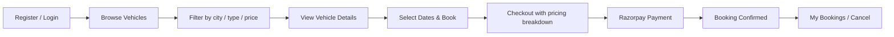
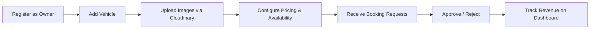
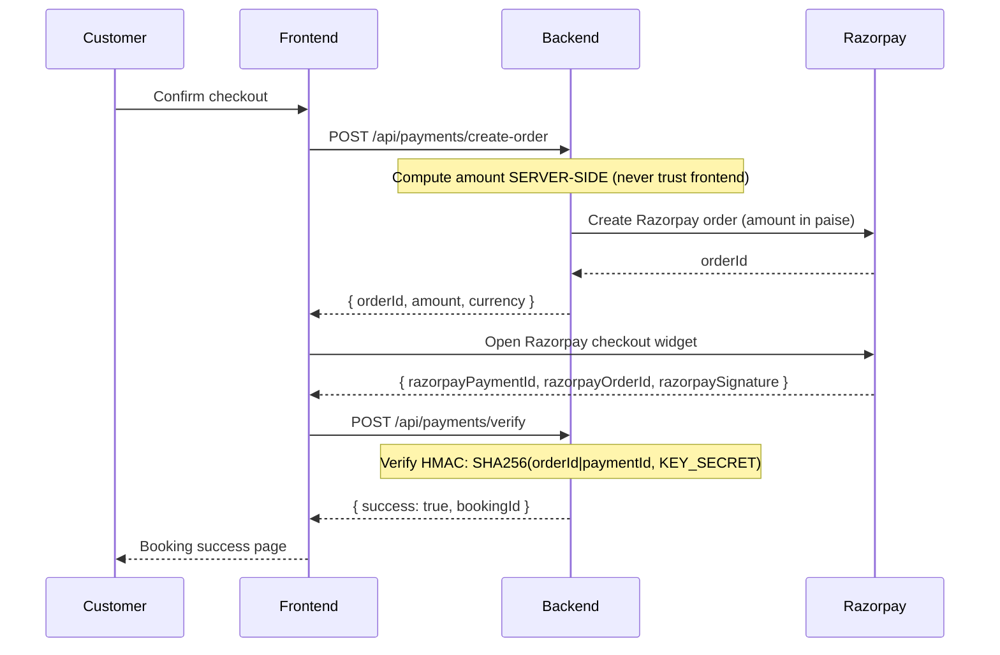

<div align="center">

# 🚗 RentX

### Production-Grade Vehicle Rental Marketplace

*A two-sided rental marketplace with transaction-safe bookings, HMAC-verified payments, and role-based access control — built to demonstrate serious full-stack engineering.*

[](https://github.com/Om-Beast/RentX)
[](https://rent-x-sd4b.vercel.app)
[](https://rentx-1-ltjq.onrender.com)


</div>

<br>

## 📖 What is RentX?

RentX is a full-stack vehicle rental marketplace on the MERN stack, designed to demonstrate the engineering depth expected at senior SDE interviews. Rather than a simple CRUD app, RentX is built around the two hardest problems in any rental marketplace:

1. **Booking correctness under concurrency** — Two customers can't book the same vehicle for the same dates, even under simultaneous requests. Solved with MongoDB transactions (TOCTOU-safe atomic overlap check + insert).

2. **Payment integrity** — The server is the single source of truth for pricing. Frontend cannot inject prices. Razorpay payments are verified server-side via HMAC signatures. Idempotency keys prevent duplicate payment records on retries.

The platform supports three roles — **Customer**, **Fleet Owner**, and **Admin** — each with dedicated flows.

<br>

## 🔑 Why This Project is Technically Interesting

| Engineering Concern | Implementation |
|---|---|
| **Booking concurrency** | MongoDB transaction wraps overlap check + insert. TOCTOU race eliminated. |
| **Payment integrity** | Server-authoritative pricing (`pricePerDay × days + GST + platform fee`). Frontend cannot send price. |
| **HMAC verification** | `razorpay_order_id\|razorpay_payment_id` signed with KEY_SECRET, verified before confirming booking. |
| **Idempotency** | Unique sparse index on `Payment.idempotencyKey`. Retried requests return stored result, not duplicate records. |
| **IDOR protection** | Every resource mutation checks `resource.owner === req.user._id`. Tests verify cross-user access returns 403/404. |
| **RBAC** | `protect()` validates JWT. `authorize(...roles)` enforces role. Admin routes use `router.use(protect, authorize("ADMIN"))`. |
| **Server-side search** | All filtering, sorting, and pagination happen in MongoDB (not in JS memory). Uses compound indexes. |
| **Trust scoring** | Deterministic 0–1000 score updated on meaningful events. Explicitly not ML — explainable rules. |
| **Bounded AI** | Gemini extracts search filters from natural language. Backend runs the real MongoDB query. AI cannot invent inventory. |
| **Background jobs** | In-process cron: hold expiry every 5 min, reminders daily at 8am. Graceful stop on SIGTERM. |
| **Structured logging** | Every request has `X-Request-ID`. Auth events, booking conflicts, payment state changes all logged. No secrets logged. |

<br>

## 🏗️ Architecture

```
Browser (React 19 + Vite + Tailwind, Vercel)
    │  HTTPS + Bearer JWT
    ▼
Express 5 REST API (Node 20, Render)
    ├─ /api/auth          — JWT auth, bcrypt (12 rounds)
    ├─ /api/vehicles      — CRUD, server-side search, Cloudinary upload
    ├─ /api/bookings      — Booking engine (MongoDB transaction)
    ├─ /api/payments      — Razorpay HMAC + idempotency + webhook
    ├─ /api/admin         — Admin RBAC console
    ├─ /api/ai            — Bounded AI (NL search, listing assistant)
    ├─ /api/dashboard     — Owner analytics (aggregation pipelines)
    ├─ /api/reviews       — Post-rental, one per booking
    └─ /api/notifications — Persistent in-app
          │
          ├─ MongoDB Atlas (replica set — required for transactions)
          ├─ Cloudinary (vehicle image CDN, graceful degradation)
          ├─ Razorpay (test mode)
          └─ Google Gemini (AI features with timeout + fallback)
```

<br>

## 🔀 Flows

<details>
<summary><strong>Customer Journey</strong></summary>


```mermaid
flowchart LR
    A[Register / Login] --> B[Browse Vehicles]
    B --> C[Filter by city / type / price]
    C --> D[View Vehicle Details]
    D --> E[Select Dates & Book]
    E --> F[Checkout with pricing breakdown]
    F --> G[Razorpay Payment]
    G --> H[Booking Confirmed]
    H --> I[My Bookings / Cancel]
```
</details>

<details>
<summary><strong>Fleet Owner Journey</strong></summary>


```mermaid
flowchart LR
    A[Register as Owner] --> B[Add Vehicle]
    B --> C[Upload Images via Cloudinary]
    C --> D[Configure Pricing & Availability]
    D --> E[Receive Booking Requests]
    E --> F[Approve / Reject]
    F --> G[Track Revenue on Dashboard]
```
</details>

<details>
<summary><strong>Booking State Machine</strong></summary>

```
PENDING_PAYMENT ──(pay within 30min)──► CONFIRMED ──► ACTIVE ──► COMPLETED
                                           │
                                           ├──(customer cancels)──► CANCELLED → REFUND_PENDING → REFUNDED
                                           └──(owner cancels)───► CANCELLED
PENDING_PAYMENT ──(30min timeout)──► EXPIRED  (background job: expireStaleHolds)
```
</details>

<details>
<summary><strong>Payment Flow (Razorpay)</strong></summary>


```mermaid
sequenceDiagram
    participant C as Customer
    participant F as Frontend
    participant B as Backend
    participant R as Razorpay

    C->>F: Confirm checkout
    F->>B: POST /api/payments/create-order
    Note over B: Compute amount SERVER-SIDE (never trust frontend)
    B->>R: Create Razorpay order (amount in paise)
    R-->>B: orderId
    B-->>F: { orderId, amount, currency }
    F->>R: Open Razorpay checkout widget
    R-->>F: { razorpayPaymentId, razorpayOrderId, razorpaySignature }
    F->>B: POST /api/payments/verify
    Note over B: Verify HMAC: SHA256(orderId|paymentId, KEY_SECRET)
    B-->>F: { success: true, bookingId }
    F-->>C: Booking success page
```
</details>

<br>

## 📁 Repository Structure

```
RentX/
├── frontend/                    # React 19 + Vite
│   ├── src/
│   │   ├── components/          # Navbar, VehicleCard, etc.
│   │   ├── pages/               # Home, VehicleListing, Checkout, etc.
│   │   ├── context/             # AuthContext (JWT + api instance)
│   │   ├── hooks/               # useCheckoutFlow
│   │   ├── api/                 # payment.api.js
│   │   ├── services/            # vehicleService.js
│   │   └── utils/               # razorpay.utils.js
│   ├── vercel.json              # SPA rewrite for nested routes
│   └── vite.config.js
│
├── backend/                     # Node 20 + Express 5
│   ├── src/
│   │   ├── app.js               # Express app (no DB, no listen — testable)
│   │   ├── server.js            # Production entry (DB + listen + jobs)
│   │   ├── config/db.js
│   │   ├── models/              # User, Vehicle, Booking, Payment, Review, etc.
│   │   ├── modules/             # Modular feature architecture
│   │   │   ├── auth/            # JWT, bcrypt, register/login
│   │   │   ├── vehicles/        # Search, CRUD, Cloudinary upload
│   │   │   ├── bookings/        # Transaction-safe booking engine
│   │   │   ├── payment/         # Razorpay HMAC + idempotency + webhook
│   │   │   ├── admin/           # Admin RBAC console
│   │   │   ├── ai/              # Bounded AI features
│   │   │   ├── trust/           # Deterministic trust scoring
│   │   │   ├── dashboard/       # Owner analytics
│   │   │   ├── reviews/         # Post-rental reviews
│   │   │   ├── notifications/   # In-app notifications
│   │   │   └── bookingRisk/     # Risk assessment
│   │   ├── middlewares/         # auth, RBAC, rateLimit, requestId, errorHandler
│   │   ├── jobs/                # node-cron background jobs
│   │   └── utils/               # logger, errors, cloudinary, generateToken
│   ├── tests/                   # Integration tests (supertest + MongoMemoryReplSet)
│   │   ├── auth.test.js
│   │   ├── booking.test.js      # Includes concurrency (TOCTOU) test
│   │   ├── trust.test.js
│   │   └── admin.test.js
│   └── scripts/
│       └── seedDemo.js          # Safe idempotent seeder (upsert, never deleteMany)
│
├── docs/
│   ├── INTERVIEW_GUIDE.md       # 30s / 2min / 5min answers + deep Q&A
│   └── SYSTEM_DESIGN.md        # Architecture, indexes, scaling path
│
├── .github/workflows/ci.yml     # Backend test + audit, frontend build
└── docker-compose.yml
```

<br>

## ✨ Feature Matrix

| Module | Key Capabilities |
|---|---|
| **Auth** | JWT, bcrypt (12 rounds), role registration, suspended user guard |
| **Vehicle Search** | Server-side filter (city, type, price, fuel, transmission, seats), pagination, sort |
| **Booking** | MongoDB transaction, TOCTOU-safe, 30-min hold, server pricing, 8+ states |
| **Payments** | Razorpay order creation, HMAC verify, idempotency key, webhook dedup |
| **Cloudinary** | Custom streaming engine, per-vehicle folder, MIME + ext + size validation |
| **Admin** | Users (suspend/restore), vehicles (activate/deactivate), analytics (real aggregation) |
| **Trust Engine** | Deterministic 0–1000 score, event history, risk-based decisions |
| **AI** | NL search (Gemini extracts filters → MongoDB), listing copy, recommendation explanation |
| **Background Jobs** | Hold expiry every 5min, pickup/return reminders daily 8am |
| **Notifications** | Persistent in-app, booking state changes, reminders |
| **Reviews** | One per completed booking, rating aggregation on vehicle |
| **Security** | IDOR guards on all mutations, field allowlist updates, rate limiting, structured errors |

<br>

## 🧰 Tech Stack

| Layer | Technologies |
|---|---|
| **Frontend** | React 19, Vite 8, Tailwind CSS, React Router 7, Axios, Framer Motion, Recharts |
| **Backend** | Node.js 20, Express 5, Mongoose 8 |
| **Database** | MongoDB Atlas (replica set — required for transactions) |
| **Auth** | JWT (`jsonwebtoken`), bcryptjs |
| **Payments** | Razorpay (HMAC signature verification) |
| **Images** | Cloudinary v2 (custom multer StorageEngine, no legacy adapter) |
| **AI** | Google Gemini (`@google/generative-ai`) |
| **Security** | `helmet`, `express-rate-limit`, `validator`, `cors` |
| **Testing** | Jest 30, Supertest, `mongodb-memory-server` (MongoMemoryReplSet) |
| **Deployment** | Backend → Render, Frontend → Vercel, DB → MongoDB Atlas |

<br>

## 🔌 API Reference

### Auth
| Method | Endpoint | Auth | Description |
|---|---|---|---|
| `POST` | `/api/auth/register` | No | Register (role: CUSTOMER, FLEET_OWNER) |
| `POST` | `/api/auth/login` | No | Login → JWT |

### Vehicles
| Method | Endpoint | Auth | Description |
|---|---|---|---|
| `GET` | `/api/vehicles` | No | Search + filter + paginate |
| `GET` | `/api/vehicles/:id` | No | Vehicle details |
| `POST` | `/api/vehicles` | FLEET_OWNER | Add vehicle |
| `PUT/PATCH` | `/api/vehicles/:id` | FLEET_OWNER | Update (field allowlist) |
| `DELETE` | `/api/vehicles/:id` | FLEET_OWNER | Delete + Cloudinary cleanup |
| `POST` | `/api/vehicles/:id/images` | FLEET_OWNER | Upload images (Cloudinary) |
| `DELETE` | `/api/vehicles/:id/images/:publicId` | FLEET_OWNER | Remove specific image |

### Bookings
| Method | Endpoint | Auth | Description |
|---|---|---|---|
| `POST` | `/api/bookings` | CUSTOMER | Create (atomic, transaction-safe) |
| `GET` | `/api/bookings/my-bookings` | CUSTOMER | My booking history |
| `GET` | `/api/bookings/owner-bookings` | FLEET_OWNER | Incoming requests |
| `PATCH` | `/api/bookings/:id/status` | FLEET_OWNER | Approve / reject |
| `POST` | `/api/bookings/:id/cancel` | CUSTOMER | Cancel + refund |

### Payments
| Method | Endpoint | Auth | Description |
|---|---|---|---|
| `POST` | `/api/payments/create-order` | CUSTOMER | Create Razorpay order (server pricing) |
| `POST` | `/api/payments/verify` | CUSTOMER | Verify HMAC signature |
| `POST` | `/api/payments/webhook` | No (raw body) | Razorpay webhook (idempotent) |

### Admin
| Method | Endpoint | Auth | Description |
|---|---|---|---|
| `GET` | `/api/admin/users` | ADMIN | Paginated user list |
| `PATCH` | `/api/admin/users/:id/suspend` | ADMIN | Suspend / restore user |
| `GET` | `/api/admin/vehicles` | ADMIN | All vehicles |
| `PATCH` | `/api/admin/vehicles/:id/moderate` | ADMIN | Activate / deactivate listing |
| `GET` | `/api/admin/analytics` | ADMIN | Platform KPIs (real aggregation) |

<br>

## 🗄️ Database Collections

| Collection | Key Fields | Indexes |
|---|---|---|
| **User** | `name, email, password(bcrypt), role, trustScore, isSuspended` | `email (unique)` |
| **Vehicle** | `owner, name, brand, pricePerDay, type, city, images[], rating` | `{type, city, isAvailable, pricePerDay}` |
| **Booking** | `user, vehicle, startDate, endDate, bookingStatus, totalAmount, expiresAt, timeline[]` | `{vehicle, startDate, endDate}`, `{user, bookingStatus}` |
| **Payment** | `booking, user, razorpayOrderId, razorpayPaymentId, amount, status, idempotencyKey` | `idempotencyKey (unique sparse)` |
| **Review** | `booking (unique), reviewer, vehicle, rating, comment` | `booking (unique)` |

<br>

## 🔐 Security Model

- **Passwords** — bcryptjs, 12 rounds. Never returned in API responses.
- **JWT** — Verified on every protected route via `protect()` middleware.
- **RBAC** — `authorize(...roles)` middleware. Admin routes use `router.use(protect, authorize("ADMIN"))`.
- **IDOR** — Every resource mutation verifies `resource.owner === req.user._id`. Tests confirm 403/404 for cross-user access.
- **Field injection** — `ALLOWED_UPDATE_FIELDS` allowlist on vehicle updates. Cannot inject `owner` or `_id`.
- **Payment verification** — HMAC computed server-side from `razorpay_order_id|razorpay_payment_id`. Never trusted from client.
- **No secrets in responses** — Stack traces hidden in production. Error shape: `{ success: false, error: { code, message, requestId } }`.
- **Rate limiting** — Login: 5/15min. Registration: 3/hour. Payment: 10/15min. AI: 20/hour.

<br>

## 🔑 Environment Variables

### Backend (`backend/.env`)

```env
PORT=5000
NODE_ENV=development

MONGO_URI=mongodb+srv://<user>:<pass>@<cluster>.mongodb.net/rentx

JWT_SECRET=<64-char random secret>

FRONTEND_URL=http://localhost:5173

RAZORPAY_KEY_ID=rzp_test_...
RAZORPAY_KEY_SECRET=...
RAZORPAY_WEBHOOK_SECRET=...

GEMINI_API_KEY=...

# Optional — enables real image uploads
CLOUDINARY_CLOUD_NAME=...
CLOUDINARY_API_KEY=...
CLOUDINARY_API_SECRET=...
```

### Frontend (`frontend/.env`)

```env
VITE_API_URL=http://localhost:5000
VITE_RAZORPAY_KEY_ID=rzp_test_...
```

<br>

## 🚀 Local Setup

```bash
# 1. Clone
git clone https://github.com/Om-Beast/RentX.git
cd RentX

# 2. Backend
cd backend
cp .env.example .env   # fill in MONGO_URI, JWT_SECRET, Razorpay keys
npm install
npm run dev            # http://localhost:5000

# 3. Frontend (separate terminal)
cd frontend
cp .env.example .env   # set VITE_API_URL=http://localhost:5000
npm install
npm run dev            # http://localhost:5173

# 4. Seed demo data (optional — idempotent, safe to run repeatedly)
cd backend
npm run seed:demo
```

<br>

## 🎭 Demo Accounts

After running `npm run seed:demo` in the `backend/` directory:

| Role | Email | Password |
|------|-------|----------|
| Customer | `demo.customer@rentx.com` | `DemoPass#2025` |
| Fleet Owner | `demo.owner@rentx.com` | `DemoPass#2025` |
| Admin | `demo.admin@rentx.com` | `DemoPass#2025` |

> ⚠️ Demo credentials only. Do not use real passwords here.

<br>

## 🧪 Testing

```bash
cd backend
npm test
```

Tests use `MongoMemoryReplSet` (single-node replica set) so MongoDB transactions work without an external MongoDB. No external services required to run the test suite.

**Test coverage:**
- `auth.test.js` — Registration, login, JWT, RBAC, duplicate email, suspended user
- `booking.test.js` — Pricing, overlap detection, TOCTOU concurrency, IDOR, cancellation
- `trust.test.js` — Score bounds, event history, deterministic deltas
- `admin.test.js` — RBAC enforcement (CUSTOMER/OWNER/unauth all get 403/401), analytics, moderation

<br>

## ☁️ Deployment

| Component | Platform | Configuration |
|---|---|---|
| **Frontend** | Vercel | `frontend/` root; `VITE_API_URL` = Render backend URL; SPA rewrite in `vercel.json` |
| **Backend** | Render | `backend/` root; start command: `node src/server.js`; health check: `/health` |
| **Database** | MongoDB Atlas | Replica set (Atlas default). Whitelist Render IPs or `0.0.0.0/0` for dev. |

<br>

## 🛣️ Honest Roadmap

**Implemented and verified:**
- ✅ Three-role marketplace (Customer + Fleet Owner + Admin)
- ✅ MongoDB transaction-based booking concurrency (TOCTOU-safe)
- ✅ Razorpay payments with HMAC verification + idempotency
- ✅ Custom Cloudinary streaming pipeline (no legacy adapter dependency)
- ✅ Admin console (users, vehicles, analytics — real server-side aggregation)
- ✅ Deterministic trust engine (0–1000, event history)
- ✅ Bounded AI (NL search, listing assistant, recommendations)
- ✅ Cancellation with tier-based refunds
- ✅ Background jobs (hold expiry, reminders) with graceful shutdown
- ✅ 0 npm vulnerabilities (backend)
- ✅ CI: backend tests + npm audit, frontend build

**Future work (honest):**
- [ ] Google OAuth login
- [ ] Redis cache for vehicle search (TTL-based)
- [ ] Email notifications (SendGrid)
- [ ] Real-time notifications (WebSocket/Socket.io)
- [ ] Review moderation in admin console
- [ ] Distributed job queue (BullMQ) for multi-instance deployments

<br>

## 📚 Documentation

- [`docs/INTERVIEW_GUIDE.md`](docs/INTERVIEW_GUIDE.md) — 30s / 2min / 5min answers + deep Q&A for every subsystem
- [`docs/SYSTEM_DESIGN.md`](docs/SYSTEM_DESIGN.md) — Architecture, indexes, booking state machine, scaling path
- [`backend/.env.example`](backend/.env.example) — All required environment variables with comments

<br>

## 📄 License

MIT — see [LICENSE](LICENSE)

<br>

## 👤 Author

[](https://github.com/Om-Beast)

<div align="center">

*Built to demonstrate production-grade full-stack engineering — booking correctness under concurrency, payment integrity, role-based security, and bounded AI — not just another CRUD marketplace.*

</div>
